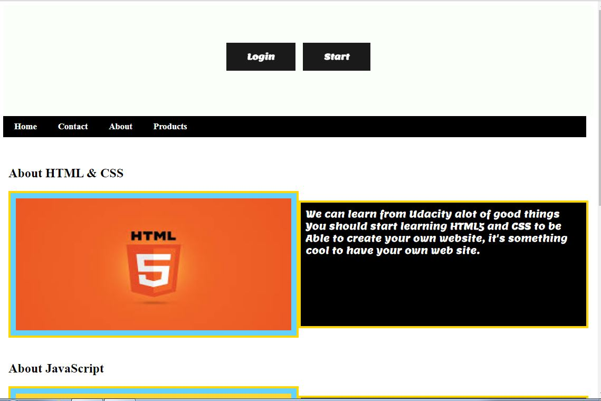
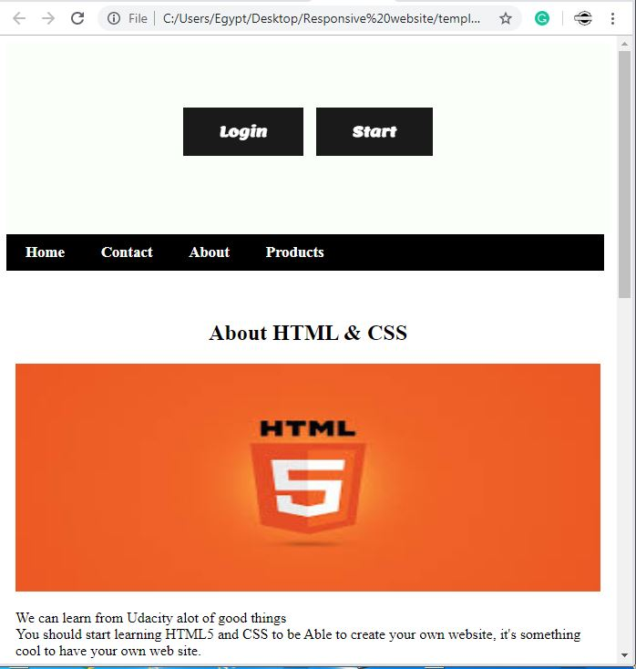

# responsive-website
<a href="https://1458bd92-afb8-4b83-821b-403ce1ece141.htmlpasta.com" target="_blank" alt="click here to open this template hosted online">Watch Project Online</a>
<h2 style="background-color:black;padding:30px;color:white;font-family:lemon;text-align:center;">responsive-website</h2>
<h3>Subscribe in Web Developer at YouTube <a href="https://www.youtube.com/watch?v=ucf2yOtU2Z4&t=1s">Web Developer</a></h3>
<a href="https://www.youtube.com/watch?v=ucf2yOtU2Z4&t=1s">
Subscribe
</a>

responsive template using HTML5 and CSS only full responsive VIP
<strong>(Free Template)</strong>
<a href="#">Free templates</a> <a href="#">free templates download</a><a href="https://www.myresponsee.com/responsive-website-templates/">Download Free Website Templates - Responsee
</a>

<strong>Screen shoots</strong>

